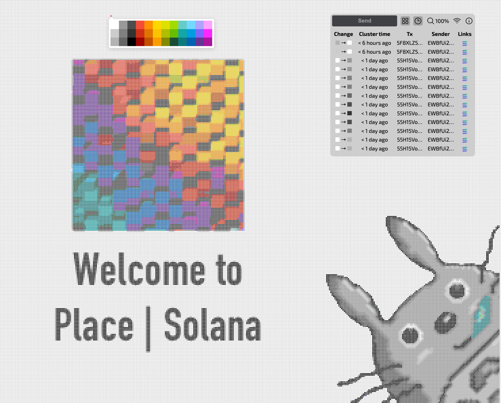

# solana-place
Pixel canvas for Solana users inspired by [r/place](https://www.reddit.com/r/place/).

# How it works
On-chain board of 300x500 pixels. Anyone can send a transaction to change a pixel to one of the 36 colors.
Service fee is 0.001 SOL.

# Further development

Lock recently-changed pixels for N seconds, or charge more SOLs to change them.

Integrate with NFTs: owner of a pixel can receive royalty fees when his/her pixel is changed.
